# uas-semaster1

# ketentuan program

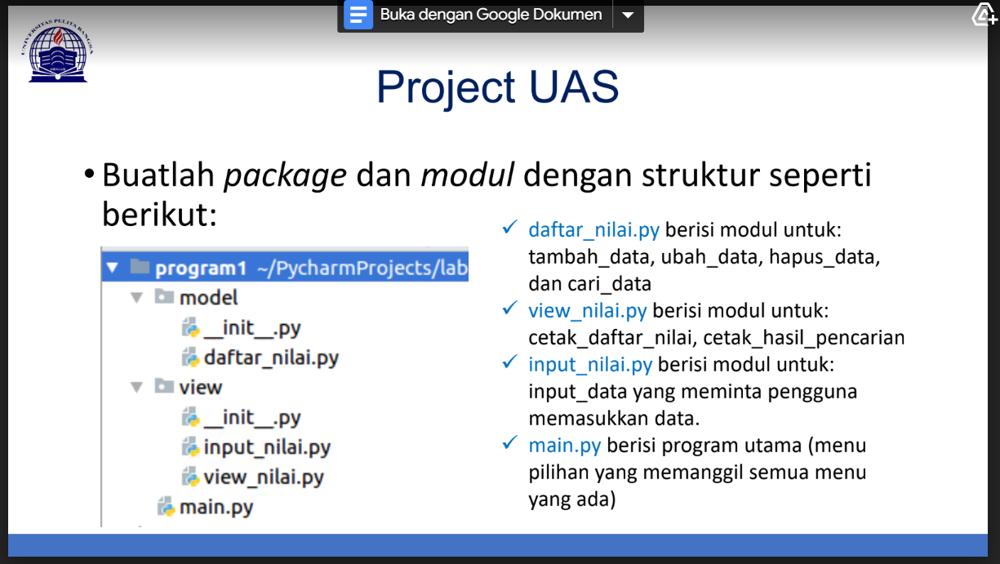

# DAFTAR NILAI
Untuk langkah pertama yaitu membuat Python file dengan nama **daftar_nilai** pada model **package** maka akan muncul seperti gambar dibawah.

# Source Code
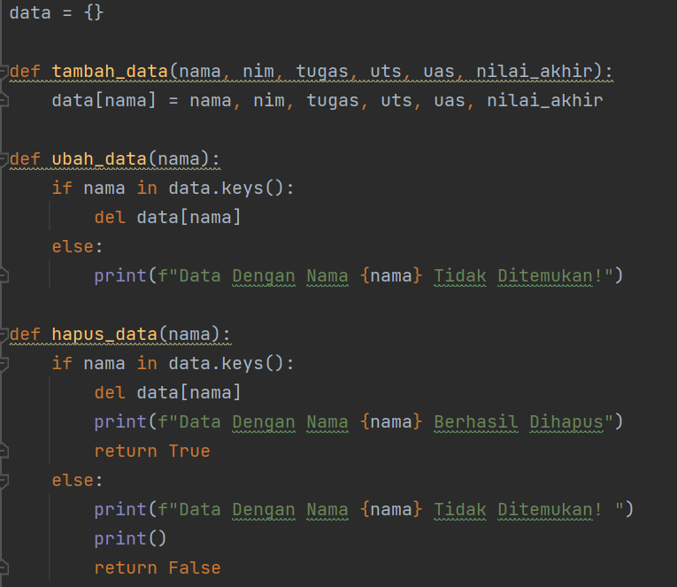
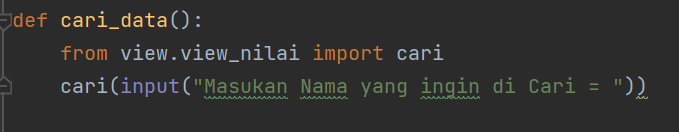

# INPUT NILAI
Lalu untuk untuk langkah selanjutnya membuat Python File dengan nama **input_nilai** pada view package.

# Source Code
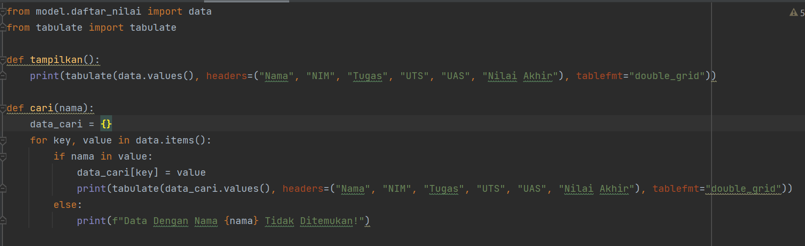

# VIEW NILAI
Lalu membuat Python File dengan nama **view_nilai** pada view package.

# Source Code
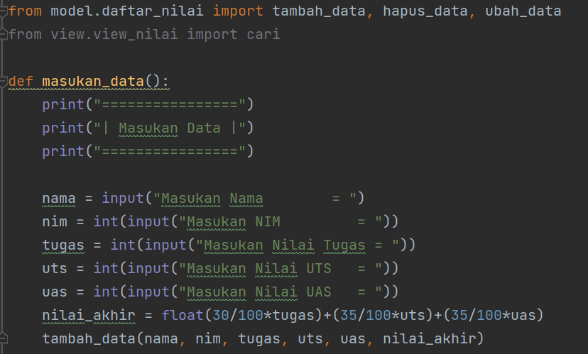
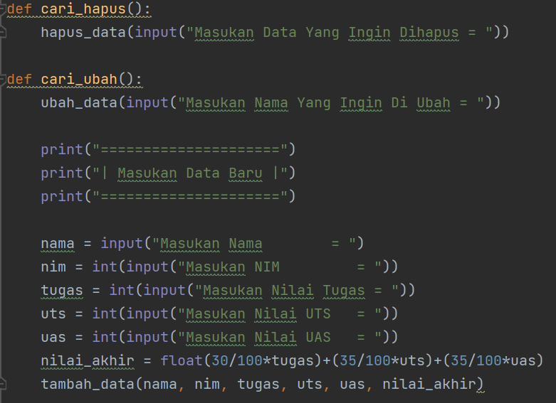

# MAIN
Langkah selanjutnya untuk yang terakhir yaitu membuat **Main.py** yang berisi kode program untuk menyatukan semua fungsi yang ada di package.

# Source Code
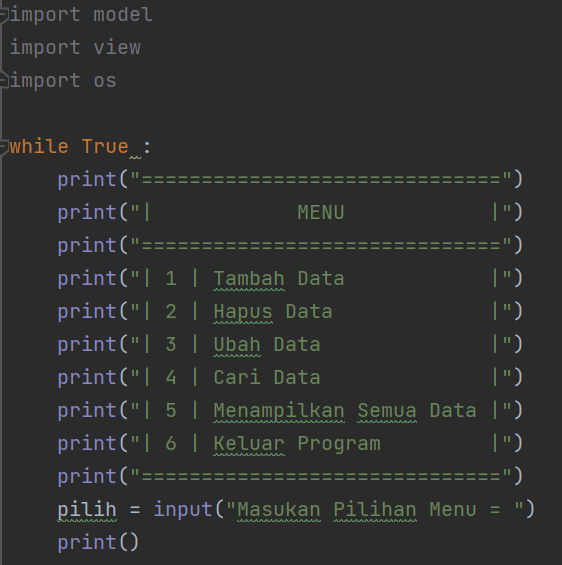
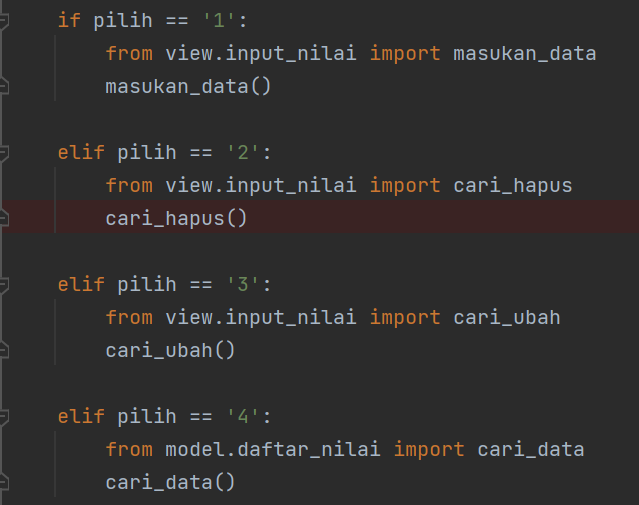
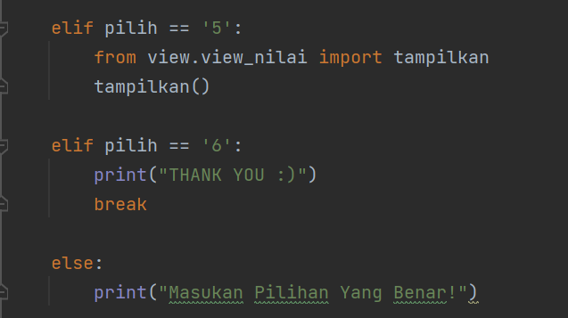

# OUTPUT
**Tambah Data**

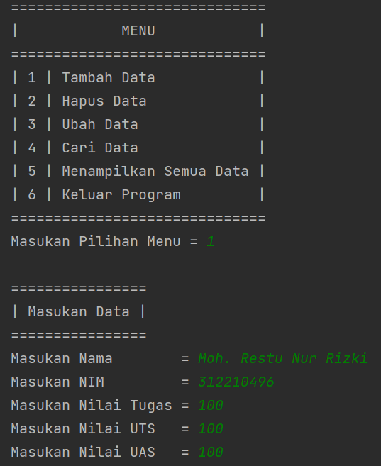

**Tampilkan Data**

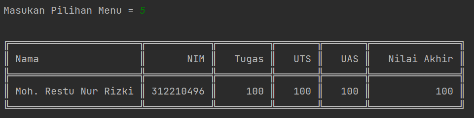

**Ubah Data**

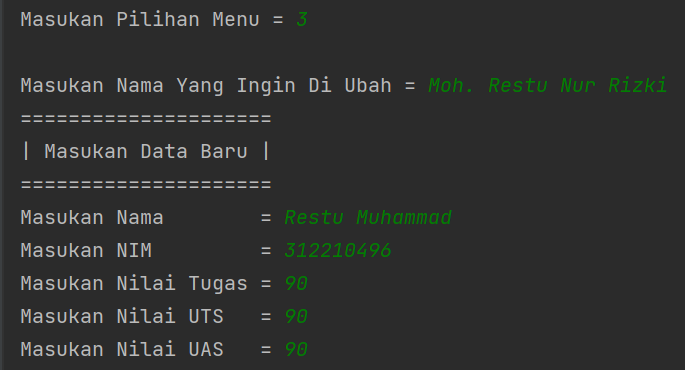

**Tampilkan Data**

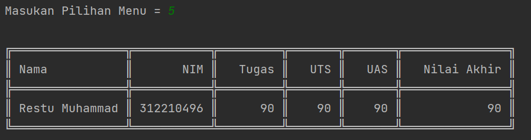

**Keluar Program**

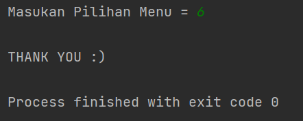
